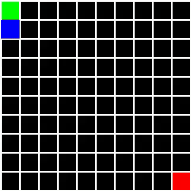

# Maze generation visualization


My project for VSB-TUO C++ course (2023-05-14).\
This tool generates a maze using selected algorithm and visualizes the process of generation.\
The program is  written in C++ and uses OpenCV for image and video generation.\
Currently supports just two algorithms: DFS and Kruskal.\
In the future, there might be more algorithms and also a maze solving part.

## Requirements

- CMake (version should not really matter, tested on 3.20)
- C++17
- OpenCV (core imgproc highgui)

## Installation

1. Clone the repository
2. Make a build directory
   2. Run `cmake .. && make -j` in the build directory
3. Run `make` in the root directory
4. Run `./maze -h` to see the help message
```bash
# Clone
git clone https://github.com/Petrkowal/maze_generator.git
cd maze_generator

# Build
mkdir build && cd build
cmake .. && make -j

# Run
./maze -h
```

## Example img outputs

<p align="center">
<image width="48%" src="assets/maze.png"/>
<image width="48%" src="assets/maze_30.png"/>
</p>

## Usage

By default, the program generates a maze of size 10x10 using the DFS algorithm.\
The generated maze is saved as `maze.png` and the video is saved as `maze.mp4`.\
The start point in the top-left corner and the end point in the bottom-right corner. The start and end points do not really matter, it was meant to be used for pathfinding algorithms... in the future. You can "disable" them by setting their color to the background color.\


```
Usage: maze [options]
Options:
  -h, --help                            Show this help message and exit
  -a, --algorithm <alg>                 Algorithm to use (dfs, kruskal)
  -s, --size <width> <height>           Size of the maze in cells
  -b, --begin <x> <y>                   Start point of the maze
  -e, --end <x> <y>                     End point of the maze
  -fps <fps>                            Frames per second for video
  --seed <seed>                         Seed for random number generator
  --no-image                            Do not generate image
  --no-video                            Do not generate video
  --out-video <filename>                Output video name
  --out-image <filename>                Output image name
  --cell-size <size_in_px>              Size of each cell in pixels
  --wall-width <size_in_px>             Width of the walls in pixels
  --wall-color <r> <g> <b>              Color of the walls
  --background-color <r> <g> <b>        Color of the background
  --current-cell-color <r> <g> <b>      Color of the current cell in video
```

Default values:
```
Algorithm:         dfs
Size:              10x10
Start point:       left top corner
End point:         bottom right corner
Frames per sec:    15
Seed:              0 (random)
Output video:      maze.mp4
Output image:      maze.png
Cell size:         30 px
Wall width:        2 px
```